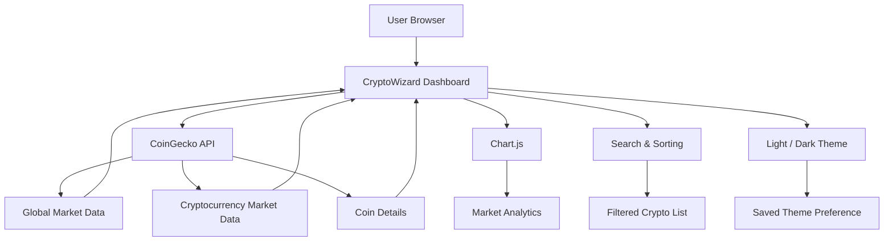

<div align="center">

# 🪙 CryptoWizard

### Modern Live Cryptocurrency Dashboard

A responsive cryptocurrency market dashboard with **live CoinGecko data**, interactive charts, search, sorting, coin details, and **light/dark themes**.

<br/>


</div>

---

## 📌 Overview

**CryptoWizard** is a modern cryptocurrency dashboard that displays real-time market information using the **CoinGecko API**.

The project is built entirely with:

* HTML
* CSS
* Vanilla JavaScript
* Chart.js

No backend server or API key is required.

The dashboard can be deployed directly using **GitHub Pages**.

---

## ✨ Features

### 📊 Live Market Data

* Real-time cryptocurrency prices
* Global crypto market capitalization
* 24-hour trading volume
* Bitcoin dominance
* Active cryptocurrency count
* Automatic market refresh

---

### 🔎 Search

Search cryptocurrencies instantly using:

* Coin name
* Coin symbol

Example:

```text
Bitcoin
BTC
Ethereum
ETH
Solana
SOL
```

---

### 📈 Interactive Charts

CryptoWizard includes visual market analytics using **Chart.js**.

#### Top Assets by Market Cap

Displays the largest cryptocurrencies ranked by market capitalization.

#### 24h Market Movers

Displays:

* 📈 Top gainers
* 📉 Top losers

---

## 🌓 Light & Dark Mode

CryptoWizard supports both:

* 🌙 Dark Mode
* ☀️ Light Mode

The selected theme is stored using `localStorage`.

This means the dashboard remembers the user's theme preference when the page is opened again.

The initial theme also follows the user's system preference.

---

## 🧠 Market Sorting

Users can sort cryptocurrencies by:

* Market Cap
* Trading Volume
* Top Gainers
* Top Losers

---

## 🪙 Coin Details

Click any cryptocurrency row to open a detailed information window.

The modal displays:

* Current price
* 24-hour price change
* Market capitalization
* 24-hour trading volume
* All-time high
* All-time low

---

## 📉 7-Day Price Trend

Each cryptocurrency displays a small **7-day sparkline chart**.

The chart automatically changes depending on price movement:

```text
Green  → Positive trend
Red    → Negative trend
```

---

## ⚡ Live API Status

The dashboard displays the current status of the CoinGecko market feed.

```text
🟢 API Online

Last Updated
04:35 PM
```

If CoinGecko cannot be reached, the status changes automatically.

---

## 🔄 Auto Refresh

Market data automatically refreshes every:

```text
60 seconds
```

Users can also manually refresh the dashboard using the refresh button.

---

## 🛡️ Error Handling

CryptoWizard includes handling for common API problems.

Examples:

```text
CoinGecko rate limit reached
```

```text
Market request failed
```

```text
Coin details unavailable
```

A retry button allows users to request market data again.

---

## 📱 Responsive Design

The dashboard is designed for multiple screen sizes.

### Desktop

* Full market table
* Analytics cards
* Charts displayed side-by-side

### Tablet

* Adaptive dashboard layout
* Responsive market cards

### Mobile

* Stacked dashboard components
* Scrollable market table
* Mobile-friendly search
* Responsive charts
* Responsive modal

---

## 🎨 UI Design

CryptoWizard uses a modern dashboard design inspired by financial and trading platforms.

The interface includes:

* Glassmorphism panels
* Gradient backgrounds
* Rounded cards
* Responsive layouts
* Smooth hover effects
* Dark/light themes
* Compact cryptocurrency charts

---

## 🧰 Tech Stack

<div align="center">

### Frontend


<br/><br/>

### Visualization


<br/><br/>

### API


<br/><br/>

### Deployment


</div>

---

## 🏗️ Architecture



---

## 📂 Project Structure

Since CryptoWizard is designed as a lightweight static application, the project can be kept very simple.

```text
CryptoWizard/
│
├── index.html
│
├── README.md
│
└── LICENSE
```

The HTML file contains:

```text
index.html
│
├── HTML structure
├── CSS styling
├── JavaScript logic
├── CoinGecko API integration
└── Chart.js integration
```

---

## 🚀 Run Locally

Clone the repository:

```bash
git clone https://github.com/YOUR-USERNAME/CryptoWizard.git
```

Open the project folder:

```bash
cd CryptoWizard
```

Then open:

```text
index.html
```

in your browser.

You can also use **VS Code Live Server**.

---

## 🌐 Deploy With GitHub Pages

Because CryptoWizard is a static application, deployment is very simple.

### 1. Upload the project

Your repository should contain:

```text
index.html
README.md
```

### 2. Open repository settings

Go to:

```text
GitHub Repository
→ Settings
→ Pages
```

### 3. Select deployment source

Choose:

```text
Deploy from a branch
```

Then select:

```text
Branch: main
Folder: /root
```

Click **Save**.

GitHub will generate a website similar to:

```text
https://YOUR-USERNAME.github.io/CryptoWizard/
```

---

## 🔌 CoinGecko API

CryptoWizard uses the free CoinGecko API.

Main endpoint:

```text
https://api.coingecko.com/api/v3
```

Market data:

```text
/coins/markets
```

Global statistics:

```text
/global
```

Coin information:

```text
/coins/{coin-id}
```

No API key is required for the basic public endpoints used by this project.

---

## ⌨️ Keyboard Features

CryptoWizard also includes small productivity features.

### Search

Press:

```text
/
```

to quickly focus the cryptocurrency search box.

### Close Modal

Press:

```text
ESC
```

to close an opened cryptocurrency details window.

---

## 🔮 Future Improvements

Possible future features include:

* ⭐ Cryptocurrency watchlist
* 💼 Portfolio tracker
* 📊 Historical price charts
* 🕯️ Candlestick charts
* 💱 Currency selection
* 🔔 Price alerts
* 📰 Cryptocurrency news
* 🪙 Trending coins
* 🔥 Fear & Greed Index
* 📱 Progressive Web App support
* 📤 Portfolio export
* 🌎 Multiple language support
* 🔐 User accounts
* ☁️ Cloud synchronization

---

## 🎯 Project Goals

CryptoWizard was created to demonstrate:

* Cryptocurrency API integration
* Responsive frontend development
* Dynamic JavaScript interfaces
* Data visualization
* Modern UI/UX design
* External API error handling
* Light/dark theme implementation

---

## 👨‍💻 Author

**Tanvir Azad Mahir**

Developer & Researcher
Bangladesh 🇧🇩

---

## 📜 Disclaimer

CryptoWizard is intended for **educational and informational purposes only**.

Cryptocurrency prices and market information may be delayed or inaccurate.

This project does **not provide financial or investment advice**.

---

## 📜 License

This project is available for educational and development purposes.

Feel free to:

* Fork the repository
* Modify the dashboard
* Improve features
* Build your own version

---

<div align="center">

## ⭐ Support

If you like **CryptoWizard**, consider giving the repository a ⭐ on GitHub.

<br/>

### `Track • Analyze • Explore • Learn`

<br/>


</div>
